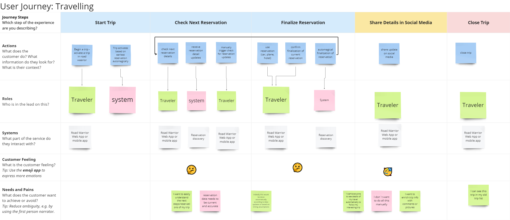

# Problem Defintion

## Mission Statement

The target is to build an online trip management application to allow travelers to manage their trips and see all of their existing reservations independent of the platform or agency where it was booked.

## User Journeys

The main interaction of the traveler (user) for the MVP is scetched with the following user journeys. 

### Planning Journey

The target of the planning journey is to plan and prepare an upcomming trip (travel)

### Travel Journey

The traget of the travel journey is to support the traveler while on the journey and provide himn with always up to date information on his current and upcomming reservations. He also should be able to trigger or digest changes in schedule, accomodation or connection details.

The user wants to share his travel with friends and family via social media channels.

### Help Journey

In case the traveler runs into conflicting information or problems when traveling, each of the agencies provides contact details, which are provided to him for easy access and fast issue resolution.

### Analytics / Reporting Journey

The traveler wants to have a reporting overview for his past travels. He wants to see past locations or used reservations/agencies. The same data will be used for Warrior general reporting.

## System Context

The traveler interacts with the Travel Warrior application (either via smart phone or web browser). The rich interface provides access to all relevant agencies for car, hotel oder flight reservations. 
Also the traveler can access reservation details from platforms like Sabre or Apollo.
The Warrior application provides interfaces to social media channels like Instagram, Whatsapp and Facebook.
For convenience reasons the traveler can allow the Warrior application to scan his mail folder (IMAP) in order to filter for travel relevant information and provide an additional input channel for travel updates as some agencies prefer this channel.

The Warrior application is split into user interface components, business logic and persistency components along travel related contexts. For details please see [SolutionStartegy.md](/02%20SolutionStrategy/SolutionStrategy.md).

## Architecture Goals

Quality Requirements: [ISO2510](https://iso25000.com/index.php/en/iso-25000-standards/iso-25010)

The following list of quality requirements is based on ISO25010. It is reduced to the more relevant characteristics and enhanced where needed. Subsets of this list are used within the ADRs to provide constraints and priorities for architecture decisions.

| Quality Requirement | Relevance | Description for Road Warrior |
| --- | --- | --- |
| Time Behaviour, Responsiveness | high | Response time web: 800ms app: 1400ms|
| Capacity, Scalability | high | 2 mio active users per week |
| Elasticity | high | Parts of the Road Warrior application has to adapt to current needs e.g. start of local vacation times like christmas or thanks giving. Also in case of issues in e.g. air traffic will lead to much more travel updates. |
| Learnability | high | Travelers will not use this on a daily base, hence the application needs to be very easy to understand |
| Accessability | high | All travlers across the world are targeted with this application, therefore different time zones, languages and currencies need to be taken into account. MVP: North America and Europe with English, French, German, Italien, Spanish language. All timezones, Two currencies US dollar and Euro |
| Availability | high | max 5 min downtime per month|
| Data Consistency | medium | no extra needs or complex data model |
| Data Currentness | high | during travel the traveler expects absolute consistency of reservation data against the source system. |
| Recoverability | high | The user needs to be able to revcover his data, if the mobile app crashes or the web browser stops. |
| Confidentiality | medium | Data privacy requirements need to be taken into account, namely GDPR in Europe. API calls need to be secured accordingly.|
| Integrity | low | There is no reservation data generated in Road Warrior. All data is comming from agencies or travel platforms as system of record. Hence no critical integrity requirements need to be considered with Road Warrior.|
| Non-Repudiation | low | Data is only read from agency APIs, no write back. No special requirements for non repudiation.|
| Testability | high | Testability is critical as the Road Warrior application needs to be adapted and enhanced easily and frequently. This requires safeguarding with automated testing, hence system design needs to support testablity.|
| Adaptability | high | High requirements to allow for application adaptation according to emerging business needs and changes in market expectations.|
| Installability | high | High demands for easy installation to allow all potential travelers in the world to use the Road Warrior app|

## Essential Constraints

The company is a start up with limited experience and capacity in developing and deploying modern architecture. The team has no experience in developing microservice architectures. We also require a short time to market in order to enable the business model quickly while limiting the cost of the MVP.

## Greatest Risks
