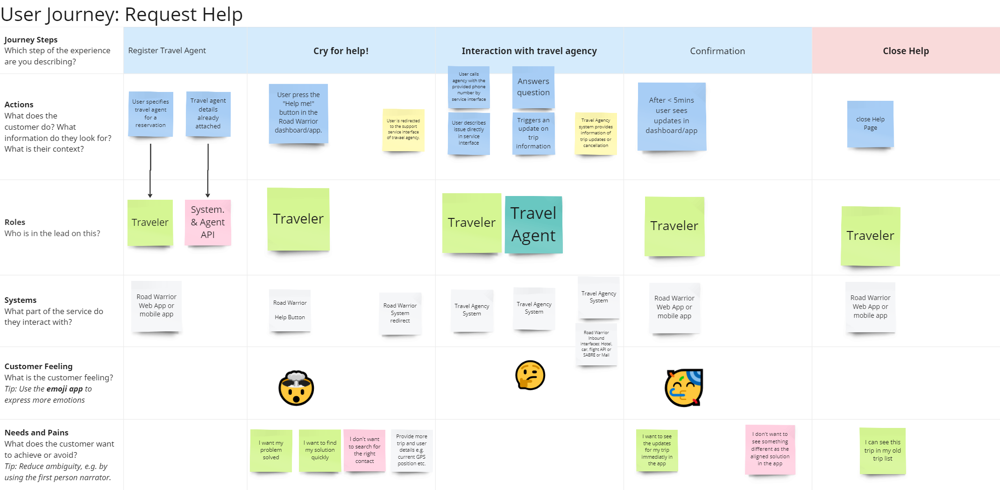

# Problem Defintion

This file provides an overview of the understanding of the described problem domain including some assumptions. The document provides a [mission statement](#mission-statement) to define the strategic target, the identified [user journeys](#user-journeys) which reflect the first iteration, further improvements are expected during walk through with domain experts and market research experts.
The [system context](#system-context) provides an understanding of what lies within the solution and which parts are external but require integration.
The [architecture goals](#architecture-goals) provide a comprehensive overview of the quality requirements for the Road Warrior application. 
[Essential constraints](#essential-constraints) provides information on overall domain constraints relevant for the Road Warrior application.
The [Largest risks](#largest-risks) section provides overall risks which might impact the timely and/or successfull go live of the Warrior application.

## Mission Statement

The target is to build an online trip management application to allow travelers to manage their trips and see all of their existing reservations independent of the platform or agency where it was booked. The benefit of the solution for the traveler is to have a one stop shop with all reservation details in one place with guarateed currentness. This is a major improvement compared to the current market standard, where travelers have to deal with multiple portals and agency pages with inconsistent data or formatting.

## User Journeys

The main interaction of the traveler (user) for the MVP is scetched with the following user journeys. 

### Planning Journey

The target of the planning journey is to plan and prepare an upcomming trip (travel). Here the emphasis is on easily building a trip consisting of different reservations for cars, flights or hotels. This preparation step helps the traveler to check completeness and consistency of all the reservations and allows him to focus on the fun part during the travel later.

### Travel Journey

The target of the travel journey is to support the traveler while on the journey and provide him with always up to date information on the current and upcomming reservations. He also should be able to trigger or digest changes in schedule, accomodation or connection details. The journey is designed to optimize the travel experience of the user. He has optimum overview over the upcomming reservations and he gets consistent and timely updates on all reservations if needed. This way the traveler can focus on the most important thing, which is enjoying the trip.

The user wants to share his trip with friends and family via social media channels.

### Help Journey

In case the traveler runs into conflicting information or problems when traveling, each of the agencies provides contact details, which are displyed by the app for easy access and fast issue resolution.

### Analytics / Reporting Journey

The traveler wants to have a reporting overview for past travels. He wants to see past locations or used reservations/agencies. The same data will be used for Road Warrior general reporting.

## System Context

The traveler interacts with the Road Warrior application (either via mobile app or web browser). The rich interface provides access to all relevant agencies for car, hotel oder flight reservations. 
The traveler can also access reservation details from platforms like Sabre or Apollo.
The Warrior application provides interfaces to social media channels like Instagram, Whatsapp and Facebook.
For convenience reasons the traveler can allow the Road Warrior application to scan his email folder (IMAP) in order to filter for travel relevant information and provide an additional input channel for travel updates as some agencies prefer this channel.

The Road Warrior application is split into user interface components, business logic and persistency components along travel related contexts. For details please see [SolutionStartegy.md](/02%20SolutionStrategy/SolutionStrategy.md).

## Architecture Goals

Quality Requirements: [ISO25010](https://iso25000.com/index.php/en/iso-25000-standards/iso-25010)

The following list of quality requirements is based on ISO25010. It is reduced to the more relevant characteristics and enhanced where needed. Subsets of this long list are used within the ADRs to provide constraints and priorities for architecture decisions.

| Quality Requirement | Relevance | Description for Road Warrior |
| --- | --- | --- |
| Time Behaviour, Responsiveness | high | Max Response time web: 800ms app: 1400ms|
| Capacity, Scalability | high | 2 mio active users per week, 15 mio users overall |
| Elasticity | high | Parts of the Road Warrior application has to adapt to current needs e.g. start of local vacation times like Christmas or Thanksgiving. Also in case of issues in e.g. air traffic will lead to many more travel updates. |
| Learnability | high | Travelers will not use this on a daily base, hence the application needs to be very easy to understand |
| Accessability | high | All travelers across the world are targeted with this application, therefore different time zones, languages and currencies need to be taken into account. MVP: North America and Europe with English, French, German, Italien, Spanish language. All timezones, two currencies: US dollar and Euro |
| Availability | high | max 5 min downtime per month|
| Data Consistency | medium | no extra needs or complex data model |
| Data Currentness | high | during travel the traveler expects absolute consistency of reservation data against the source system. |
| Recoverability | high | The user needs to be able to revcover his data, if the mobile app crashes or the web browser stops. |
| Confidentiality | medium | Data privacy requirements need to be taken into account, namely GDPR in Europe. API calls need to be secured accordingly.|
| Integrity | low | There is no reservation data generated in Road Warrior. All data is comming from agencies or travel platforms as system of record. Hence no critical integrity requirements need to be considered with Road Warrior.|
| Non-Repudiation | low | Data is only read from agency APIs, no write back. No special requirements for non repudiation.|
| Testability | high | Testability is critical as the Road Warrior application needs to be adapted and enhanced easily and frequently. This requires safeguarding with automated testing, hence system design needs to support testablity.|
| Adaptability | high | High requirements to allow for application adaptation according to emerging business needs and changes in market expectations.|
| Installability | high | High demands for easy installation to allow all potential travelers in the world to use the Road Warrior app|

## Essential Constraints

The company is a startup with limited experience and capacity in developing and deploying modern architecture. The team has no experience in developing microservice architectures. 
Being a startup with limited funding, the target is to have an MVP available with short time to market.
We also require a short time to market in order to enable the business model quickly while limiting the cost of the MVP. An early market penetration is crucial to be able to attract further funding, also with early users we will have a great learning curve and can adapt the early application according to the learnings.

## Largest Risks

* Availability, data currentness, correctness: Users are not able to use the Road Warrior app during the travel or app shows wrong data. If there are changes in a trip communicated on short notice, but user is not informed about the app, user propably will not trust the app anymore in future. Furthermore user will not trust the app if the shown trip schedule is wrong (independent of the reason). 
* There is a connected risk, because the success of the Warrior application depends on the timely and acurate delivery of reservation updates by the agencies. If the agencies fail to deliver updates in time or inconsistent the user will atribute this to Warrior application.
* Security: Especially ensure data privacy concerns for all the processed and stored data. This topic is addressed in an additional [CrossCuttingConcern for security](/03%20SolutionDetails/CrossCuttingConcern_Security.md).
