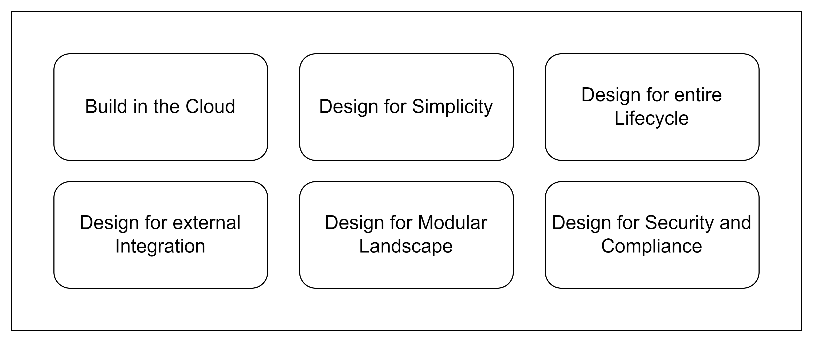
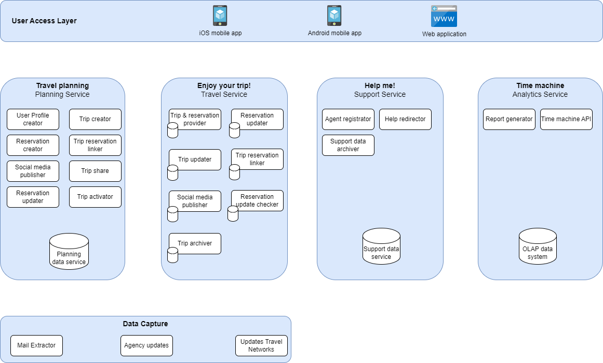
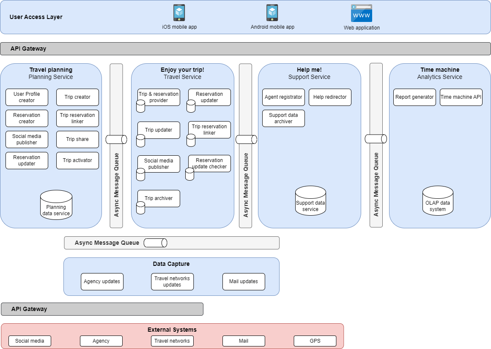

# Solution Strategy
This Document provides a high level overview of the to be architecture for the Road Warrior application. It is intended to serve as foundation to ensure joint understanding how the defined problem of the traveler domain will translate into a solution, which takes architecture constraints and architecture principles into account.

## Solution Strategy

We are proposing to build the solution with a Service-based architecture with four services. The services follow the user journey analysis described in the [problem definition](/01%20ProblemDefintion/ProblemDefinition.md#user-journeys). We propose to separate these user journeys as they emphasize different architecture characteristics. While a fast response and up-to-date reservation data is particularly important during the travel in case of changing plans or travel schedules, we could lift these requirements a bit during the planning phase of a journey.

We propose to couple the domains loosely by triggering messages between the domains that follow the user journeys. The travel planning domain, for instance, hands over trip and reservation data once a trip starts or gets activated by a user and the _Enjoy your trip!_ domain sends data to the _Time machine_ through the trip archiver service. Using message queues between the domain we can buffer data in case of domain service failure and allow recovery without loosing data.

On the data part we propose to build single data backends per service. If the development team has the skillset to orchestrate services automatically, the _Enjoy your trip!_ domain will benefit from building into a microservice architecture just for that domain as it has the highest requirements in terms of availability and scalability in case of unforeseen traveling events like flight cancellations due to heavy storms. The same holds true for the _Help me!_ domain which requires elasticity in case of larger user request floods due to afore mentioned events.

## Architecture Principles

The Architecture principles are designed to guide architecture and design decision as guardrails and help find sustainable answers to balancing questions.

[TOGAF on Architecture Principles:](https://pubs.opengroup.org/architecture/togaf9-doc/arch/chap20.html)

> Principles are general rules and guidelines, intended to be enduring and seldom amended, that inform and support the way in which an organization sets about fulfilling its mission.
>
>In their turn, principles may be just one element in a structured set of ideas that collectively define and guide the organization, from values through to actions and results.

### Principle: Build in the cloud
We build cloud native solutions where deployment, monitoring and operations can be automated with APIs. This is important to adress the high time2market needs. Maximum automation can provide us the framework to deliver often and quickly with high reliability.

### Principle: Design for simplicity
We strive for simple architectures, which are easier to communicate, build, deploy, operate, and evolve. This is important to start lean and address the needs of an MVP follow _fail early fail often_ maxime, allowing for fast learning and improvement.

### Principle: Design for modular landscape
We balance loose coupling and coherence. This is important to allow for loose coupling of different contexts (plan journey vs. travel journey), whereas within the context coupling can be more tight if the coherence is high and the component allows this trade off.

### Principle: Design for external integration
We allow to connect to a growing ecosystem. This is crucial, as the Warrior app heavily depends on external interfaces to deliver vlue to its users (travelers). Without accurate and timely integration to agencies and travel systems the Warrior app cannot deliver on its promisses.

### Principle: Design for the entire lifecycle
We design for maintainability of technologies, applications and data. This principle is intended to guide the team in the direction of sustainability. The advise is to have easy resolution and high obervability of the application in mind to ensure best user experience during runtime. Avoid single focus on development time.

### Principle: Design for security and compliance
We ensure legal constraints and ensure external regulations by design. As GDPR is an important an relevant regulation in EU, security by design is imporant. Most security decisions must ba taken early in the product development process, Later mitigation/correction is very costly (if possible at all).

## Component Overview Diagram

The following diagram provides insights into the overall context and respective services and components for the Warrior application. It is possible to optimize each serivce according to the architectual characteristics. Due to the specific elasticity requirements for the Travel Service it was decided to use a microservice architecture to reflect this.

## Integration View
It provides a scetch of the communication and interaction patterns required for cross service communication and external communication. The User Front Ends interact via RESTful APIs with the service layer. the different services are decoupled via asynchronous message queues with domain events to avoid blocking and enable independent scaling of travel service. External systems are connected via APIs (agencies, social media) or IMAP for mail. 

## Trade Offs 

This chapter provides guardrails on balancing questions due to conflicting requirements or other constraints.

### Simplicity of approach vs. full elasticity

Considering limited capacity and capability in designing and deploying fully distributed microservice architectures to serve elasticity, it is decided to start with a service based approach, which segregates business domains along expected differences in quality requirements. This allows a fast time to market with the existing group and allows for easy optimization later on the roadmap.
Namely the Enjoy your Trip context is expected to have highest needs for elasticity.

### Short time to market vs. global reach and latency requirements

We assume the market go live is in north america. Here the latency requirements can be met with proposed architecture. Later for international rollouts to Europe or Asia it is planned to have a content delivery framework integrated as a partner solution to allow full scalling and still provide expected latency requirements even in remote regions. This requires more investments, which makes the successfull go live in North America even more important.
