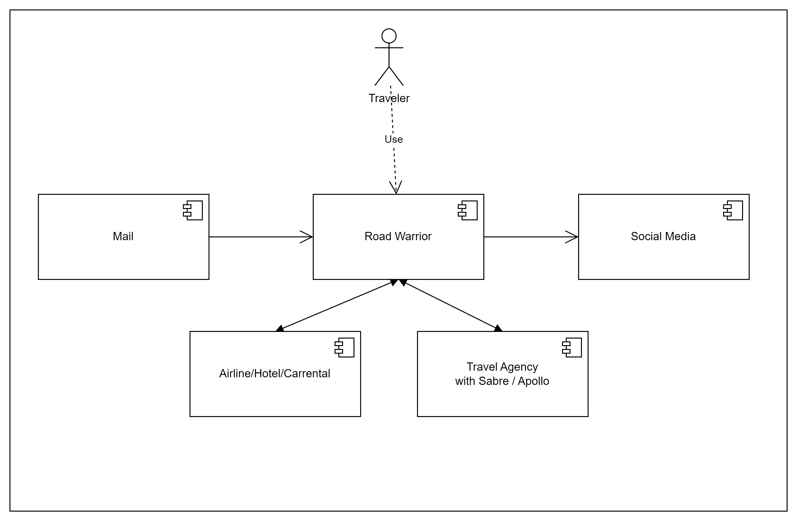
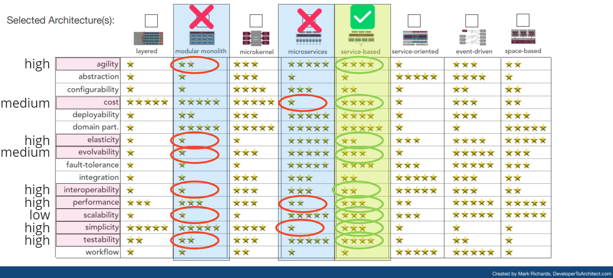

# 1. ADR-0001 RoadWarrior Basic Architecture Pattern
<!-- Architecture Decision Record for relevant/important architecture or design decisions with product, cross product or platforms. The general purpose is to make the problem statement, conflicting requirements and analyzed solutions explicit. Use for important decisions and focus on essential information and diagramming. -->

* Status: accepted <!-- mandatory -->
* Deciders: Jan, Philip, Oliver <!-- mandatory -->
* Date: 09-14-2023 <!-- mandatory -->

## 1.1 Context and Problem Statement

The target is to build an online trip management application to allow travelers to manage their trips and see all of their existing reservations.

User Access to the Road Warrior will be via Web Browser, iOS or Anroid app.

## 1.2 Decision Drivers

It needs to be clarified, how the overall architecture pattern looks like. What are the guidelines for composition and communication.

### 1.2.1 Architecture Principles

- Build in the cloud, build cloud native solutions where deployment, monitoring and operations can be automated with APIs.
- Design for simplicity, we strive for simple architectures, which are easier to communicate, build, deploy, operate, and evolve.
- Design for modular landscape, we balance loose coulpling and coherence.
- Design for external integration, we allow to connect to a growing eco system.

### 1.2.2 Quality Requirements
Quality Requirements: [ISO2510](https://iso25000.com/index.php/en/iso-25000-standards/iso-25010)

For detailled information on relevance for Warrior application please consult: [ProblemDefinition.md](/01%20ProblemDefintion/ProblemDefinition.md)

For the overall architecture pattern decision the following quality requirements are considered most relevant:

| Quality Requirement | Relevance | Description for Road Warrior |
| --- | --- | --- |
| Time Behaviour, Responsiveness | high | Response time web: 800ms app: 1400ms|
| Capacity, Scalability | high | 2 mio active users per week |
| Elasticity | high | Parts of the Road Warrior application has to adapt to current needs e.g. start of local vacation times like christmas or thanks giving. Also in case of issues in e.g. air traffic will lead to much more travel updates. |
| Availability | high | max 5 min downtime per month|
| Data Currentness | high | during travel the traveler expects absolute consistency of reservation data against the source system. |
| Testability | high | Testability is critical as the Road Warrior application needs to be adapted and enhanced easily and frequently. This requires safeguarding with automated testing, hence system design needs to support testablity.|
| Adaptability | high | High requirements to allow for application adaptation according to emerging business needs and changes in market expectations.|

## 1.3 Considered Options and Decision Outcome

* Option 1: Modular Monolith
* Option 2: Microservices
* option 3: Service-Based

Of course we have to balance the different decision drivers but in the end we decided for option 3 with the opportunity to further split some services in direction of microservices if it is required after the MVP.

Chosen option: "Option 3: Service-Based", because this architcture style is coarse-grained and based on this is more simple, less costs,  but allows to be flexible to further split the services. Especially for elasticity reasons it could make sense to get to a more fine grained service. In general it allows fast development and isolated deployment. It requires highly advanced skill set in development team though.

## 1.4 Pros and Cons of the Options <!-- optional -->

[Highlight business benefits, technical impact and possible new technical debts]

### 1.4.1 Modular Monolith

[Short description of scetchd solution]

* Good, because [argument a]
* Good, because [argument b]
* Bad, because [argument c]
* … <!-- numbers of pros and cons can vary -->

### 1.4.2 Microservices

[Short description of scetchd solution]

* Good, because [argument a]
* Good, because [argument b]
* Bad, because [argument c]
* … <!-- numbers of pros and cons can vary -->

### 1.4.3 Service-Based

[Short description of scetchd solution]

* Good, because [argument a]
* Good, because [argument b]
* Bad, because [argument c]
* … <!-- numbers of pros and cons can vary -->