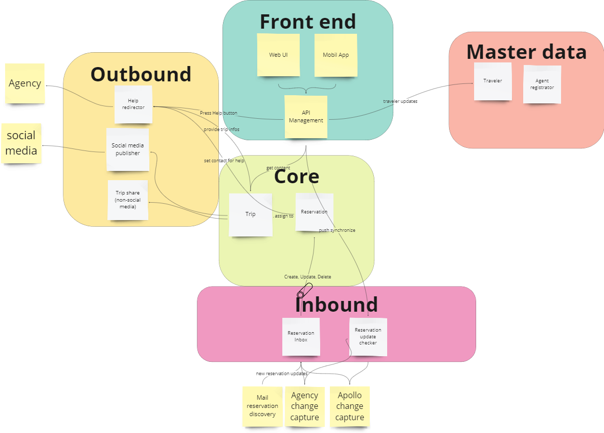

# 1. ADR-0002 RoadWarrior FrontEnd Architecture 
<!-- Architecture Decision Record for relevant/important architecture or design decisions with product, cross product or platforms. The general purpose is to make the problem statement, conflicting requirements and analyzed solutions explicit. Use for important decisions and focus on essential information and diagramming. -->

* Status: accepted <!-- mandatory -->
* Deciders: Jan, Philip, Oliver <!-- mandatory -->
* Date: 09-14-2023 <!-- mandatory -->

## 1.1 Context and Problem Statement

The target is to build an online trip management application to allow travelers to manage their trips and see all of their existing reservations.

The question to answer is: What is the best modularisation within the Road Warrior application to support the requirements especially the non-functional requirements and architecture principles.

[Provide relevant diagram for decision, focus on essential information for described problem. examples: Delimit your system, define boundaries and describe external interfaces with context diagram. Provide static decomposition of the product or platform in scope with building block view. Provide runtime view if required with sequence diagram]

## 1.2 Decision Drivers

It needs to be clarified, how the overall architecture pattern looks like. What are the guidelines for composition and communication.

### 1.2.1 Architecture principles
- Simplicity: Drive to have a very simple, easy to understand architecture
- Cloud First: Drive for scalable cloud solution.
- API First: Drive for decoupling components and enable reuse of APIs

### 1.2.2 Quality Requirements
Quality Requirements: [ISO25010](https://iso25000.com/index.php/en/iso-25000-standards/iso-25010)

For detailled information on relevance for Warrior application please consult: [ProblemDefinition.md](/01%20ProblemDefintion/ProblemDefinition.md)

For the overall architecture pattern decision the following quality requirements are considered most relevant:

| Quality Requirement | Relevance | Description for Road Warrior |
| --- | --- | --- |
| Time Behaviour, Responsiveness | high | Response time web: 800ms app: 1400ms|
| Capacity, Scalability | high | 2 mio active users per week |
| Elasticity | high | Parts of the Road Warrior application has to adapt to current needs e.g. start of local vacation times like christmas or thanks giving. Also in case of issues in e.g. air traffic will lead to much more travel updates. |
| Learnability | high | Travelers will not use this on a daily base, hence the application needs to be very easy to understand |
| Accessability | high | All travlers across the world are targeted with this application, therefore different time zones, languages and currencies need to be taken into account. MVP: North America and Europe with English, French, German, Italien, Spanish language. All timezones, Two currencies US dollar and Euro |
| Availability | high | max 5 min downtime per month|
| Data Consistency | medium | no extra needs or complex data model |
| Data Currentness | high | during travel the traveler expects absolute consistency of reservation data against the source system. |
| Recoverability | high | The user needs to be able to revcover his data, if the mobile app crashes or the web browser stops. |
| Confidentiality | medium | Data privacy requirements need to be taken into account, namely GDPR in Europe. API calls need to be secured accordingly.|
| Integrity | low | There is no reservation data generated in Road Warrior. All data is comming from agencies or travel platforms as system of record. Hence no critical integrity requirements need to be considered with Road Warrior.|
| Non-Repudiation | low | Data is only read from agency APIs, no write back. No special requirements for non repudiation.|
| Testability | high | Testability is critical as the Road Warrior application needs to be adapted and enhanced easily and frequently. This requires safeguarding with automated testing, hence system design needs to support testablity.|
| Adaptability | high | High requirements to allow for application adaptation according to emerging business needs and changes in market expectations.|
| Installability | high | High demands for easy installation to allow all potential travelers in the world to use the Road Warrior app|

## 1.3 Considered Options and Decision Outcome

[Provide summary of considered options as one liners and provide reasoning for  selected option, based on above Problem Statement, Architecture principles and considered Quality Requirements.]

* Option 1: Create modules along data flow (Inbound, Outbound, Frontend, etc.) 
* Option 2: Create modules along domains with some cross domain modules for reusability

Chosen option: "Option 2 along domains with cross domain", because this cluster enables on the one side to have isolated teams working on their domain, to meet different architectural characteristics per module but on the other side avoids too much diplication with the cross domain modules. It requires highly advanced skill set in development team though.

## 1.4 Pros and Cons of the Options <!-- optional -->

### 1.4.1 Create modules along data flow (Inbound, Outbound, Frontend, etc.)

Follow the data flow through the app and divide in logical modules focusing on the the technical solution behind. In Frontend team front end technologies are needed, in Inbound and outbound mor integration technologies are needed and in core the business logic and calculation engine is created.

* Easy to understand
* Less duplication in functionalities
* Bad, because of not able to reflect the different architecture characteristics for different user journeys in the application. Everything is highly coupled from a domain perspective, for a change probably all modules have to be toughed.
* … <!-- numbers of pros and cons can vary -->

### 1.4.2 Create modules along domains with some cross domain modules for reusability

Split focused on the user interaction with the system, the big user journeys and business domains: Travel planning, traveling itself and the help function. As some of the components are required in several modules, we decided to additinally seperate the user interface, the data capture and the data collection.

* Follows the logical organisation of the business domain
* Possible to reflect different archtitecture characteristics
* As it is domain driven, changes can be isolated in one or two of the modules.
* Reusability is enabled with some cross domain moodules for data capture and user interface
* Bad, because of different technologies have to be included in one mudule, so also the reuired skills are not isolated. 
* Bad, because from technical perspective more capababilities have to be provided in each of the module teams.
* … <!-- numbers of pros and cons can vary -->
