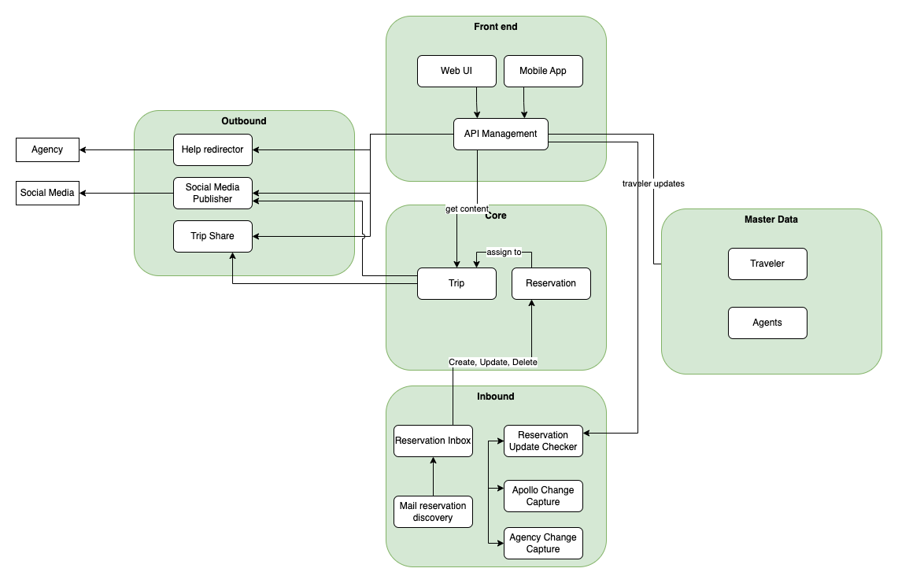

# 1. ADR-0003 Road Warrior Service Boundaries 
<!-- Architecture Decision Record for relevant/important architecture or design decisions with product, cross product or platforms. The general purpose is to make the problem statement, conflicting requirements and analyzed solutions explicit. Use for important decisions and focus on essential information and diagramming. -->

* Status: accepted <!-- mandatory -->
* Deciders: Jan, Philip, Oliver <!-- mandatory -->
* Date: 09-14-2023 <!-- mandatory -->

## 1.1 Context and Problem Statement

The target is to build an online trip management application to allow travelers to manage their trips and see all of their existing reservations.

The decision which is described in this ADR: **What are the best service boundaries** within the Road Warrior application to support the requirements especially the quality requirements and architecture principles?

## 1.2 Decision Drivers

It needs to be clarified, how the overall architecture pattern looks like. What are the guidelines for composition and communication.

### 1.2.1 Architecture principles
From all architecture principles the following ones are most relevent for this decision:
* Design for simplicity, we strive for simple architectures, which are easier to communicate, build, deploy, operate, and evolve.
* Design for modular landscape, we balance loose coulpling and coherence.
* Design for external integration, we allow to connect to a growing ecosystem.

### 1.2.2 Quality Requirements
Quality Requirements: [ISO25010](https://iso25000.com/index.php/en/iso-25000-standards/iso-25010)

For detailled information on relevance for Warrior application please consult: [ProblemDefinition.md](/01%20ProblemDefintion/ProblemDefinition.md)

From the overall architecture pattern decision the following quality requirements are considered most relevant for this ADR, keeping in mind that part of this decision is to manage different quality requirements to the different services:

| Quality Requirement | Relevance | Description for Road Warrior |
| --- | --- | --- |
| Elasticity | high | Parts of the Road Warrior application have to adapt to current needs e.g. start of local vacation times like Christmas or Thanksgiving. Also in case of issues in e.g. air traffic will lead to many more travel updates. |
| Availability | very high | max 5 min downtime per month|
| Data Consistency | medium | no extra needs or complex data model |
| Data Currentness | very high | during travel the traveler expects absolute consistency of reservation data against the source systems. |
| Testability | high | Testability is critical as the Road Warrior application needs to be adapted and enhanced easily and frequently to incorporate user feedback and new functionality timely. This requires safeguarding with automated testing, hence system design needs to support testablity. |
| Adaptability | high | High requirements to allow for application adaptation according to emerging business needs and changes in market expectations.|

The quality requirements or architectual charateristics are not equally important for the whole application. If possible it should be considered to meet the requirements as shown based on the user journeys below: 

## 1.3 Considered Options and Decision Outcome

* Option 1: Decouple services along data flow (Inbound, Outbound, Frontend, etc.) 
* Option 2: Decouple services along domains only
* **Option 3: Decouple services along domains with some cross domain services for reusability**

**Chosen option: "Option 3 along domains with cross domain services"**, because this clustering enables on the one side to have isolated teams working on their domain and to meet different architectural characteristics per service but on the other side avoids too much duplication with usage of cross domain services. It requires highly advanced skill set in development team though.

## 1.4 Pros and Cons of the Options <!-- optional -->

### 1.4.1 Create modules along data flow (Inbound, Outbound, Frontend, etc.)

Follow the data flow through the app and divide in logical modules focusing on the the technical solution behind. In Frontend team front end technologies are needed, in Inbound and outbound more integration technologies are needed and in core the business logic and calculation engine is created.

* Good: Easy to understand
* Good: Little to no duplication in functionalities
* Bad: Tight coupling between services allow no flexibility in terms of architecture characteristics. All systems have to deliver highest requirements in terms of availability and elasticity. Changes are difficult as many parts need to be touched to change one workflow affecting other workflows as well.

### 1.4.2 Create services along domains only

Following the concept of Domain Driven Design in this option we split the services completly along the identified domains, which are defined by the [user journeys](/01%20ProblemDefintion/ProblemDefinition.md#user-journeys). In contrast to option 3, the user front end and the interfaces to data sources are duplicated and part of each service.

* Good, Follows the logical organisation of the business domain
* Good, Possible to reflect different archtitecture characteristics
* Good, As it is domain driven, changes can be isolated in one or two of the modules.
* Bad, because some functionalities as user interface, data collection for analytics and interfaces to source system are duplicated and have to be maintained seperatly. This will lead to inconsistencies in the individual solutions.
* Bad, because of different technologies have to be included in one mudule, so also the required skills are not isolated. 
* Bad, because from technical perspective more capababilities have to be provided in each of the module teams.

### 1.4.3 Create modules along domains with some cross domain modules for reusability

Split focused on the user interaction with the system, the big user journeys and business domains: Travel planning, traveling itself and the help function. As some of the components are required in several modules, we decided to additinally seperate the user interface, the data capture and the data collection.

* Good, Follows the logical organisation of the business domain
* Good, Possible to reflect different archtitecture characteristics
* Good, As it is domain driven, changes can be isolated in one or two of the modules.
* Good, Reusability is enabled with some cross domain moodules for data capture and user interface
* Bad, because of different technologies have to be included in one mudule, so also the required skills are not isolated. 
* Bad, because from technical perspective more capababilities have to be provided in each of the module teams.
